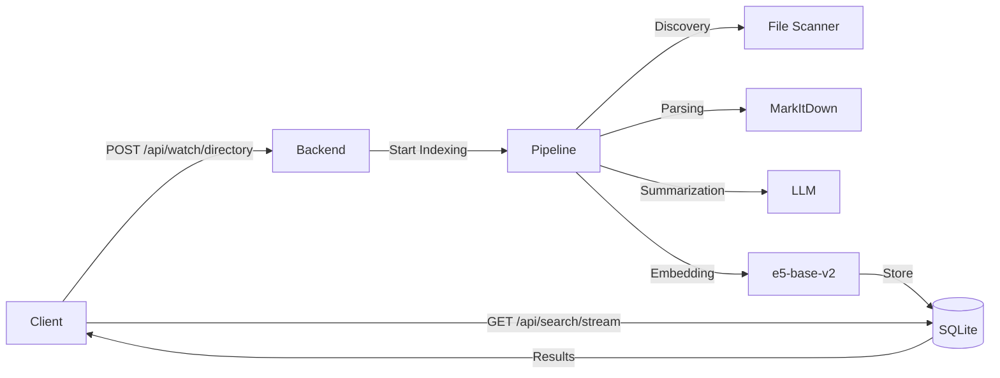

## Welcome

The CosmaSense backend exposes a RESTful API for managing file indexing and search operations. The backend runs on port `60534` by default.

**Base URL:** `http://localhost:60534`

All endpoints are local-only and require no authentication. The backend is designed to run on your local machine and is not intended to be exposed to the internet.

## Quick Start

Start the backend server:

```bash
cosma serve
```

Test the connection:

```bash
curl http://localhost:60534/api/health
```

## Core Endpoints

<CardGroup cols={2}>

<Card title="Watch Directory" icon="folder-open" href="/api-reference/endpoint/create">
  Add a directory to the watch list and start indexing
</Card>

<Card title="Search Files" icon="magnifying-glass" href="/api-reference/endpoint/get">
  Search indexed files using natural language queries
</Card>

<Card title="Get Watched Directories" icon="list" href="/api-reference/endpoint/delete">
  List all directories currently being watched
</Card>

<Card title="Real-time Updates" icon="bolt" href="/api-reference/endpoint/webhook">
  Stream processing status updates via Server-Sent Events
</Card>

</CardGroup>

## Response Format

All API responses follow a consistent JSON format:

```json
{
  "status": "success",
  "data": { ... },
  "error": null
}
```

Error responses:

```json
{
  "status": "error",
  "data": null,
  "error": {
    "code": "VALIDATION_ERROR",
    "message": "Invalid directory path"
  }
}
```

## Data Flow



## Rate Limiting

The backend does not implement rate limiting as it's designed for local use only. However, the TUI implements client-side throttling (0.5s) for search queries to reduce unnecessary API calls.

## File Processing States

When files are being indexed, they go through several states:

| State | Description |
|-------|-------------|
| `pending` | File discovered, waiting to be processed |
| `parsing` | Extracting content from file |
| `summarizing` | AI generating summary and keywords |
| `embedding` | Creating vector embedding |
| `complete` | Successfully indexed |
| `failed` | Error during processing |

You can monitor these states in real-time using the `/api/updates` SSE endpoint.
