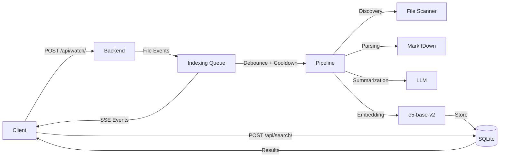

## Welcome

The CosmaSense backend exposes a RESTful API for managing file indexing, search, queue control, and real-time updates. The backend runs on port `60534` by default.

**Base URL:** `http://localhost:60534`

All endpoints are local-only and require no authentication. The backend is designed to run on your local machine and is not intended to be exposed to the internet.

## Quick Start

Start the backend server:

```bash
cosma serve
```

Test the connection:

```bash
curl http://localhost:60534/api/status/
```

## Endpoint Groups

<CardGroup cols={2}>

<Card title="Watch Directory" icon="folder-open" href="/api-reference/endpoint/watch">
  Add a directory to the watch list and start indexing
</Card>

<Card title="Search Files" icon="magnifying-glass" href="/api-reference/endpoint/search">
  Search indexed files using natural language queries
</Card>

<Card title="Watch Jobs" icon="list" href="/api-reference/endpoint/jobs">
  List and manage watched directory jobs
</Card>

<Card title="Queue Control" icon="layer-group" href="/api-reference/endpoint/queue">
  Pause, resume, and inspect the indexing queue
</Card>

<Card title="Scheduler" icon="clock" href="/api-reference/endpoint/scheduler">
  Configure automatic pause/resume based on system conditions
</Card>

<Card title="Real-time Updates" icon="bolt" href="/api-reference/endpoint/updates">
  Stream processing status updates via Server-Sent Events
</Card>

<Card title="Filters" icon="filter" href="/api-reference/endpoint/filters">
  Configure file inclusion/exclusion patterns
</Card>

<Card title="Settings" icon="gear" href="/api-reference/endpoint/settings">
  Read and update application settings
</Card>

</CardGroup>

## Data Flow



## File Processing States

When files are being indexed, they go through several states reported via SSE:

| State | SSE Opcode | Description |
|-------|-----------|-------------|
| Queued | `queue_item_added` | File added to indexing queue, waiting for cooldown |
| Processing | `queue_item_processing` | Cooldown expired, processing started |
| Parsing | `file_parsing` | Extracting content from file |
| Summarizing | `file_summarizing` | AI generating summary and keywords |
| Embedding | `file_embedding` | Creating vector embedding |
| Complete | `file_complete` | Successfully indexed |
| Failed | `file_failed` | Error during processing |

Monitor these states in real-time using the `/api/updates` SSE endpoint.
